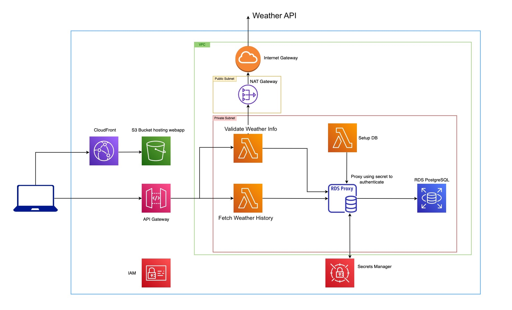
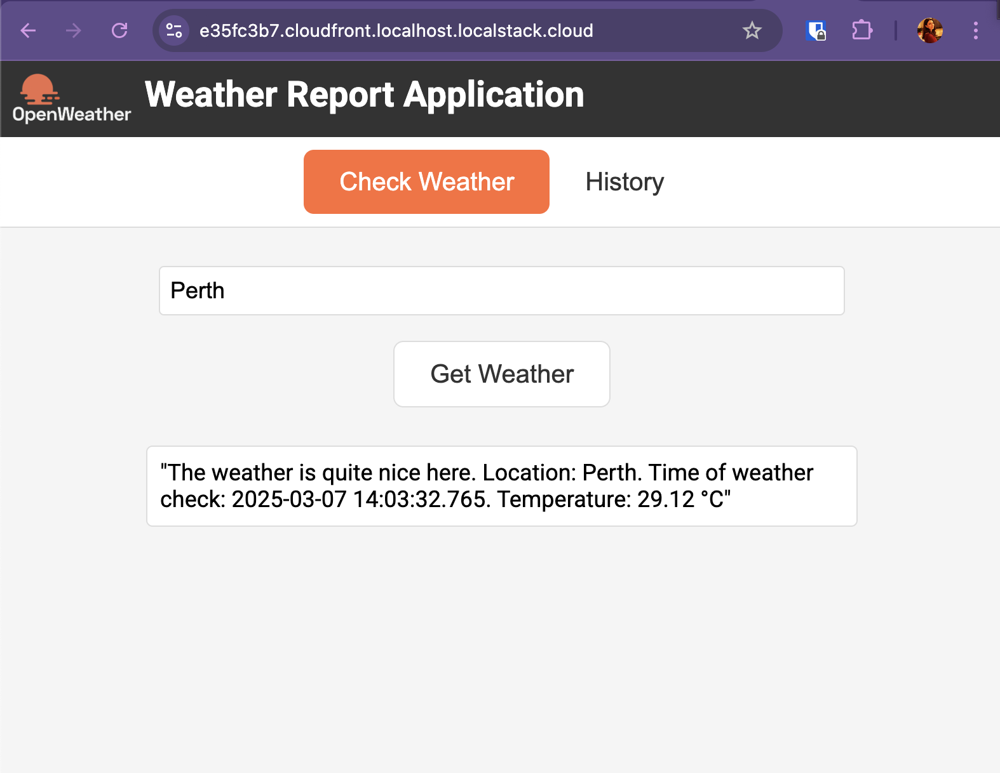
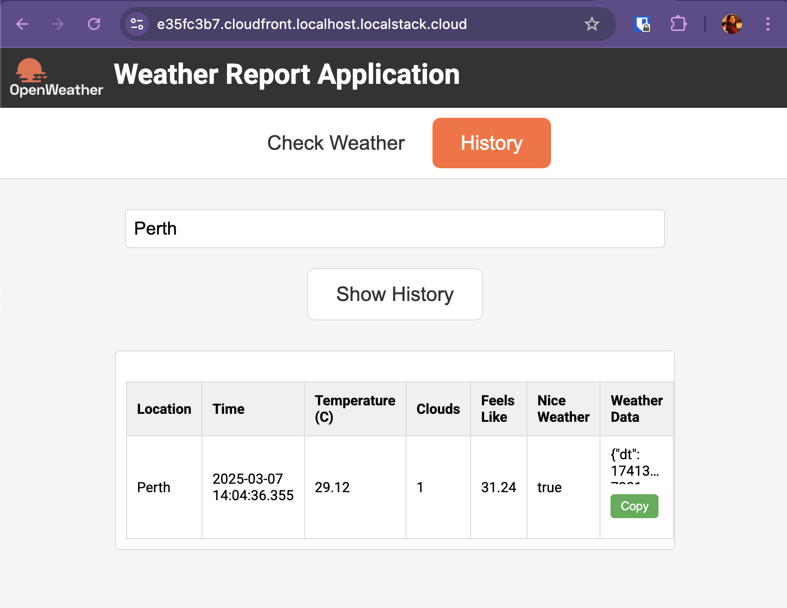

# Weather Validator Project

## Overview
This project is a Weather Validator that uses AWS services (Lambda, RDS, S3, and API Gateway, VPC, NAT Gateway, Internet Gateway, etc).
The architecture can be seen below:



The application has a frontend component, using HTML, CSS, and JavaScript. 
The backend is composed of Lambda functions written in Java. 
The database is an RDS PostgreSQL instance.

## Prerequisites

**For Local Development** (requires a [LocalStack for AWS license](https://localstack.cloud/pricing)):

- Docker
- Java 21
- Maven (3.9.9)
- Node.js (v23.5.0)
- Terraform (v1.9.3) + [terraform-local](https://github.com/localstack/terraform-local)
- [LocalStack](https://docs.localstack.cloud/getting-started/installation/) (for local development)
- AWS CLI
- [Open Weather API key (free tier)](https://home.openweathermap.org/api_keys) - to include in terraform/variables.tf and terraform-local/variables.tf
- A valid [LocalStack for AWS license](https://localstack.cloud/pricing). Your license provides a [`LOCALSTACK_AUTH_TOKEN`](https://docs.localstack.cloud/getting-started/auth-token/) to activate LocalStack.

**For Deployment to AWS**:

- AWS CLI
- Terraform (v1.9.3)

## Deploying to AWS

Before proceeding, make sure you have the AWS CLI configured with the necessary permissions (use `aws configure`). Additionally, your account will need a user with `AdministratorAccess` policy attached.
In other words:
```json
{
    "Version": "2012-10-17",
    "Statement": [
        {
            "Effect": "Allow",
            "Action": "*",
            "Resource": "*"
        }
    ]
}
```

For a fast and easy deployment, you can use the following steps.
The Lambda `jar` files are already included in the project.

```shell
cd terraform
terraform init
terraform plan
terraform apply --auto-approve
```

Once this is done, you will need to run the following command to create the database tables:
```shell
aws lambda invoke --function-name db-setup --region us-east-1 output.json 
```

See the CloudFront URL in the output of the Terraform run. You can access the application using this URL.
That's it! You have successfully deployed the Weather Validator project to AWS.

### If you need to make changes in the cloud

**Backend**:

- change java files in the `backend` directory
- run `mvn clean install` in the `backend` directory
- run `aws lambda update-function-code --function-name history-lambda --zip-file fileb://history-lambda/target/history-lambda-1.0.0.jar` - change according to the function you are updating

**Frontend**:

- change files in the `frontend` directory
- run `aws s3 sync ./ s3://weather-validator-bucket` in the `frontend` directory

**Infrastructure**:

- change `.tf` files in the `terraform` directory
- run `terraform apply --auto-approve` in the `terraform` directory


## Running the application locally
### Backend - Lambda functions (make changes as you see fit):

```sh
    cd backend
    mvn clean install
```

### Frontend 

Install `http-server`:

```sh
npm install --global http-server
```
or

```sh
brew install http-server
```

Then:
```shell
cd frontend
http-server
```

You can change the files as needed. The frontend will be available at `http://localhost:8080`.

### Run LocalStack and Deploy Infrastructure Locally

Start LocalStack Pro with the `LOCALSTACK_AUTH_TOKEN` pre-configured:

```sh
export LOCALSTACK_AUTH_TOKEN=<your-auth-token>
localstack auth set-token $LOCALSTACK_AUTH_TOKEN
DEBUG=1 localstack start -d
```

**Deploy Infrastructure Locally**:

After installing terraform-local, run the following commands:

```sh
    cd terraform-local
    tflocal init
    tflocal apply --auto-approve
```

Once this is done, you will need to run the following command to create the database tables:
```shell
awslocal lambda invoke --function-name db-setup --region us-east-1 output.json 
```

or

```shell
 aws --endpoint=http://localhost.localstack.cloud:4566 lambda invoke --function-name db-setup --region us-east-1 output.json
 ```

**Note!** 
It could happen that the `tflocal apply` executes successfully, but the resources are _not ready yet_, hence the endpoints will not be available to pass to the Lambdas and environment variables.
Check the `terraform.tfstate` file, particularly for the `HOST` and `PORT` environment variables in the `aws_lambda_function` resource. 
These are the endpoint and port for the RDS Proxy instance.
In this case, please run the command again. You will see that a few resources have changed:

```shell
Apply complete! Resources: 0 added, 8 changed, 0 destroyed.
```

In the Check Weather tab, you can enter a city name and click the "Get Weather" button. 
The application will display the weather for the city you entered, along with the verdict: the weather must be over 20 degrees Celsius with no clouds.
Otherwise, the application will display a message saying the weather is not nice.



The history tab will display the history of the cities you have checked the weather for.
The full data from the Weather API can be copied to the clipboard by clicking the "Copy" button.




## Cleaning Up
- **Destroy the cloud resources**:
    
```sh
    cd terraform
    terraform destroy
```

- **Destroy local resources**:

```sh
    cd terraform-local
    tflocal destroy
```
Or just shut down the LocalStack container:

```sh
    localstack stop
```